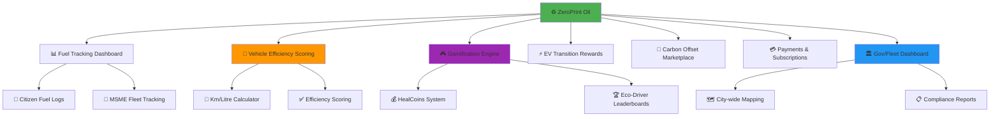
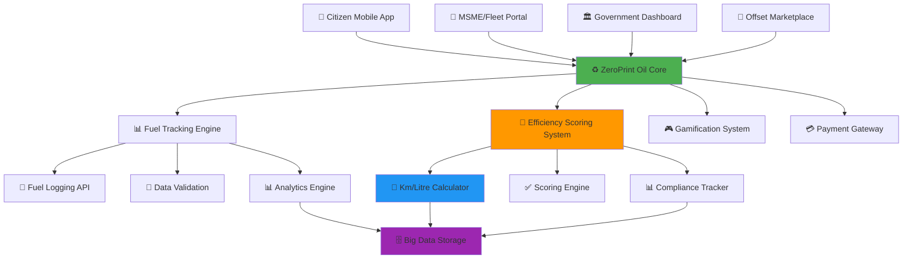
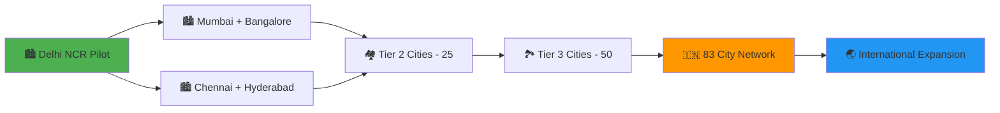

# ♻️ ZeroPrint Oil
### *Reducing India's Fossil Fuel Dependency and Driving the Clean Energy Revolution*

<div align="center">

[](https://oil.zeroprint.ai)
[](https://ev.oil.zeroprint.ai)
[](https://offset.oil.zeroprint.ai)
[](https://oil.zeroprint.ai/eco)


**♻️ FROM FUEL DEPENDENCY TO CLEAN MOBILITY ♻️**  
*The AI-Powered Solution: Fuel Tracking + Efficiency Scoring + EV Incentives + Carbon Offsets*

[📊 Citizen Dashboard](https://citizen.oil.zeroprint.ai) • [🏢 MSME Portal](https://msme.oil.zeroprint.ai) • [🏛️ Government Dashboard](https://gov.oil.zeroprint.ai) • [♻️ Carbon Offset Marketplace](https://offset.oil.zeroprint.ai)

</div>

---

## ⛽ **India's Fossil Fuel Crisis**

<div align="center">

### 💸 **India's Fuel Dependency Reality**

| Crisis Area | Annual Impact | Hidden Cost |
|-------------|---------------|-------------|
| ⛽ **Crude Oil Imports** | 85% of consumption | ₹10 Lakh Cr economic burden |
| 🌍 **CO₂ Emissions** | 2.5+ billion tonnes | Environmental degradation |
| 🏠 **Citizen Awareness** | No emission feedback | Zero motivation for efficiency |
| 🏛️ **Government Gaps** | Limited real-time data | FAME II goals lagging |

</div>

> **The shocking truth: India’s fuel consumption outpaces its renewable energy growth.**  
> **85% oil imports + 2.5B tonnes CO₂ + zero citizen feedback = ECONOMIC & ENVIRONMENTAL EMERGENCY**

**🎯 ZeroPrint Oil is the AI-powered solution that tackles FOUR challenges with ONE platform:**

---

## 🌟 **The Quadruple Revolution**

<table>
<tr>
<td width="25%" align="center">

### 👥 **CITIZENS**
#### *From Fuel Waste to Eco-Drivers*

❌ **Before**: No emission tracking  
✅ **After**: Track fuel, earn HealCoins

📊 Real-time fuel logs  
🚗 Efficiency scoring  
🎮 Gamified challenges  
🌱 Carbon offset options  

</td>
<td width="25%" align="center">

### 🏢 **MSMEs/FLEETS**
#### *From Inefficiency to Optimization*

❌ **Before**: Manual fuel tracking  
✅ **After**: Digital efficiency dashboards

🏆 Fleet performance rankings  
📈 Fuel cost analytics  
🎯 Emission reduction goals  
🏅 EV transition rewards  

</td>
<td width="25%" align="center">

### 🏛️ **GOVERNMENT**
#### *From Blindspots to Insights*

❌ **Before**: No fleet emission data  
✅ **After**: Real-time analytics

🗺️ City-wide efficiency maps  
📊 Compliance reporting  
📋 Old vehicle flagging  
🎯 FAME II progress tracking  

</td>
<td width="25%" align="center">

### ♻️ **CARBON OFFSETS**
#### *From Emissions to Solutions*

❌ **Before**: No offset access  
✅ **After**: Verified offset marketplace

📱 Redeem HealCoins for credits  
✅ Partnered NGO projects  
💰 CSR-funded offsets  
📈 Emission reduction tracking  

</td>
</tr>
</table>

---

## 🏗️ **7 Revolutionary Modules**

<div align="center">



</div>

---

## 📊 **Module 1: Fuel Tracking Dashboard**
*Real-Time Fuel and Emission Intelligence*

### 👥 **For Citizens - Track Your Fuel Footprint**

<div align="center">

#### ⛽ **Fuel Consumption Intelligence**

| Fuel Category | Tracking Method | Smart Analysis |
|---------------|-----------------|----------------|
| ⛽ **Petrol** | Litres, cost, date | CO₂ emissions (2.3 kg/litre) |
| 🛢️ **Diesel** | Litres, cost, date | CO₂ emissions (2.7 kg/litre) |
| ⚡️ **EV Charging** | kWh (future API) | Zero-emission tracking |
| 🌱 **Clean Fuels** | Litres, type | Emission reduction impact |

</div>

#### 🔍 **Auto-Impact Calculation**
```
⛽ Fuel → Environmental Impact
├── Litres consumed → CO₂ emissions (petrol: 2.3 kg/L, diesel: 2.7 kg/L)
├── Fuel spend → Cost tracking
├── Efficiency score → Km per litre
└── Eco-score → HealCoins earning opportunity
```

### 🏢 **For MSMEs/Fleets - Fleet Tracking**

#### 📈 **Fleet Analytics**
- **🏢 Fleet Benchmarking**: Compare with industry averages
- **📊 Efficiency Scoring**: 0-100 fuel efficiency rating
- **⛽ Fuel Reduction Goals**: Monthly optimization targets
- **🏆 Competition Readiness**: Inter-fleet eco-challenges

### 🔄 **Live Dashboard Features**
```
📊 REAL-TIME METRICS
├── ⛽ Total fuel consumed (litres)
├── 📊 CO₂ emissions (kg)
├── 💸 Fuel expenditure (₹)
├── 📈 Monthly/weekly trends
├── 🎯 Personalized efficiency tips
└── 💎 HealCoins earning tracker
```

---

## 🚗 **Module 2: Vehicle Efficiency Scoring**
*Turning Fuel Data into Actionable Insights*

### 🚗 **Efficiency Calculation**

<div align="center">

#### 📏 **Vehicle Efficiency Metrics**

| Metric | Input Method | Output |
|--------|--------------|--------|
| 🛣️ **Km Travelled** | Manual entry / odometer photo | Total distance |
| ⛽ **Fuel Used** | Litres logged | Efficiency (km/L) |
| 📊 **Comparison** | Vs vehicle class average | Score: Excellent/Average/Poor |
| 🌱 **Impact** | CO₂ savings vs average | HealCoins earned |

</div>

### 🔐 **Scoring Process**
```
🚗 EFFICIENCY SCORING WORKFLOW
├── 🚘 User logs km travelled (manual/photo)
├── ⛽ Links to fuel purchase data
├── 📏 Calculates km per litre
├── 📊 Compares vs vehicle class average
├── ✅ Assigns score: Excellent (>120% avg), Average (80-120%), Poor (<80%)
└── 💰 Awards HealCoins based on score
```

### 🎯 **Scoring Rewards**
- **✅ Excellent Efficiency**: 50 HealCoins per 100 km
- **📷 Odometer Photo**: Additional 10 HealCoins
- **🏆 Monthly Top Efficiency**: Bonus 200 HealCoins
- **🌟 Fleet Leader**: Recognition + CSR rewards

---

## 🎮 **Module 3: Gamification Engine**
*Making Fuel Efficiency Addictively Fun*

### 🏆 **Challenge System**

<div align="center">

| Challenge Level | Target | HealCoins Reward | Real Impact |
|-----------------|--------|------------------|-------------|
| 🌱 **Eco Starter** | 10% fuel reduction | 100 HealCoins | 5 kg CO₂ saved |
| 🚗 **Green Driver** | 20% fuel reduction | 300 HealCoins | 15 kg CO₂ saved |
| ⚡️ **Eco Champion** | 30% fuel reduction | 600 HealCoins | 30 kg CO₂ saved |
| 🏆 **Zero Emission Hero** | EV adoption | 1,000 HealCoins | 50 kg CO₂ saved |

</div>

### 🏅 **Multi-Level Competition**
```
🏆 LEADERBOARD CATEGORIES
├── 🚗 Individual Eco-Drivers
├── 🏢 MSME Fleet Champions
├── 🏘️ Community Green Rankings
├── 🗺️ City-wide Eco-Challenges
└── 🌍 National Efficiency Championships
```

### 💰 **HealCoins Redemption Ecosystem**
- **🛒 Green Store Discounts**: EV accessories, fuel-efficient tires
- **🌱 Carbon Offset Credits**: Redeem for tree planting, renewables
- **⚡️ EV Charging Vouchers**: Free/discounted charging
- **🎁 Sustainability Rewards**: Reusable bottles, bike-sharing passes
- **💳 Cash Redemption**: Direct wallet transfer via Razorpay

---

## ⚡️ **Module 4: EV/Green Transition Rewards**
*Incentivizing the Shift to Clean Mobility*

### 🚘 **EV Adoption Incentives**

#### 📋 **Transition Features**
```
⚡️ EV TRANSITION SYSTEM
├── 🚗 User marks vehicle as EV in profile
├── ✅ Verification via registration (future: charging API)
├── 💰 Bonus HealCoins for EV adoption
├── 🏆 EV badge on leaderboards
└── 🤝 CSR sponsorships for fleet transitions
```

### 📱 **Reward System**
- **⚡️ EV Declaration**: 500 HealCoins one-time bonus
- **📷 Charging Log (Future)**: 20 HealCoins per charge
- **🏆 Fleet EV Transition**: 5,000 HealCoins per vehicle
- **🌟 CSR Recognition**: Public acknowledgment for green fleets

---

## 🌱 **Module 5: Carbon Offset Marketplace**
*Turning Emissions into Environmental Good*

### 🌍 **Offset Project Integration**

<div align="center">

#### 🌱 **Offset Project Categories**

| Project Type | CO₂ Offset per 1,000 HealCoins | Partner Type |
|--------------|-------------------------------|--------------|
| 🌳 **Tree Planting** | 50 kg CO₂ | NGOs, Green Initiatives |
| ☀️ **Renewable Energy** | 40 kg CO₂ | Solar/Wind Projects |
| ♻️ **Waste-to-Energy** | 45 kg CO₂ | Recycling Partners |
| 🌾 **Sustainable Agriculture** | 30 kg CO₂ | Rural Cooperatives |

</div>

### 🔄 **Offset Redemption Process**
```
🌱 CARBON OFFSET WORKFLOW
├── 📱 User selects offset project
├── 💰 Redeems HealCoins for CO₂ credits
├── ✅ Transaction logged with project partner
├── 📊 Offset impact displayed in dashboard
├── 🏆 Certificate issued for offset contribution
└── 🤝 CSR sponsorships amplify offset impact
```

---

## 💳 **Module 6: Payments & Subscriptions**
*Monetizing Fuel Intelligence*

### 💰 **Flexible Pricing Tiers**

<div align="center">

| User Type | Annual Fee | Features | Target Market |
|-----------|------------|----------|---------------|
| 👥 **Citizen Basic** | ₹100 | Fuel tracking, basic tips | Budget-conscious drivers |
| 👥 **Citizen Premium** | ₹500 | Efficiency scoring, offset access | Eco-conscious individuals |
| 🏢 **MSME Standard** | ₹2,500 | Fleet tracking, efficiency reports | Small fleets |
| 🏢 **MSME Pro** | ₹10,000 | Advanced analytics, EV incentives | Large fleets |
| 🏛️ **Government SaaS** | ₹2,50,000 | City-wide dashboards, compliance reports | Transport departments |

</div>

### 🔄 **Revenue Model Breakdown**
```
💸 MULTIPLE REVENUE STREAMS
├── 📱 Consumer subscriptions: ₹20 Cr/year potential
├── 🏢 MSME/fleet subscriptions: ₹50 Cr/year potential
├── 🏛️ Government contracts: ₹100 Cr/year potential
├── 💰 HealCoins transaction fees: ₹10 Cr/year potential
├── 🤝 CSR partnerships for EV/offsets: ₹25 Cr/year potential
└── 📊 Data licensing for policy: ₹15 Cr/year potential
```

---

## 🏛️ **Module 7: Government/Fleet Admin Dashboard**
*AI-Powered Fuel Policy & Fleet Optimization*

### 🗺️ **City-Wide Fuel Monitoring**

#### 📊 **Live Intelligence Map**
- **🟢 High Efficiency Zones**: >90% fleet efficiency
- **🟡 Moderate Efficiency**: 70-90% efficiency
- **🟠 Needs Improvement**: 50-70% efficiency
- **🔴 High Emission Zones**: <50% efficiency, immediate action needed

### 📋 **Admin Action Center**
```
🏛️ GOVERNMENT/FLEET DASHBOARD
├── 🚨 Real-time alerts: High-emission vehicles
├── 📊 Fleet analysis: Efficiency trends
├── 🗺️ Geographic hotspots: Inefficient zones
├── 📈 Emission predictions: Seasonal patterns
├── 🎯 Policy tracking: FAME II progress
├── 📋 Automated reports: Compliance summaries
└── 💼 Fleet optimization: Vehicle replacement plans
```

### 🎯 **Policy Integration**
- **📊 FAME II Compliance**: EV adoption tracking
- **🏙️ Smart Cities Mission**: Fuel efficiency component
- **♻️ Emission Reduction Goals**: CO₂ savings optimization
- **🌱 Climate Action**: Carbon footprint reduction metrics
- **📱 Citizen Engagement**: Eco-driving participation

### 📈 **Impact Measurement**
```
🎯 GOVERNMENT SUCCESS METRICS
├── ⛽ Fuel efficiency improvement: % increase in km/L
├── 💰 Fleet cost savings: ₹ saved through optimization
├── ⚡️ EV adoption rate: % of fleet electrified
├── 🌱 CO₂ emissions reduction: Tonnes avoided
├── 👥 Citizen engagement: App adoption rates
└── 🏆 Policy effectiveness: FAME II goal tracking
```

---

## 🏗️ **Technical Architecture - Built for National Scale**

### 🔧 **Technology Stack**

<div align="center">

| Component | Technology | Scalability Reason |
|-----------|------------|-------------------|
| 📱 **Mobile App** | React Native + TypeScript | Cross-platform deployment |
| 🌐 **Web Platform** | Next.js + Tailwind CSS | Fleet/Gov dashboard needs |
| 📸 **Odometer System** | React Native Camera | Photo-based verification |
| 🗄️ **Database** | PostgreSQL + Redis | Fuel and emission data |
| ☁️ **Cloud Infrastructure** | AWS + Firebase + Docker | Auto-scaling to millions |
| 📊 **Analytics** | Apache Spark + Elasticsearch | Real-time processing |
| 🔐 **Security** | JWT + OAuth 2.0 + Encryption | Government-grade protection |

</div>

### 🌐 **System Architecture**



---

## 🚀 **2-Week Sprint to National Deployment**

### 📅 **Week 13: Core Fuel & Vehicle Modules**

<div align="center">

| Day | Focus Area | Key Deliverables |
|-----|-----------|------------------|
| **Day 1-2** | 🔧 **Infrastructure Setup** | Vehicles/fuelLogs collections, authentication |
| **Day 3-4** | 📊 **Fuel Tracking** | Fuel input form, CO₂ calculation, monthly charts |
| **Day 5-6** | 🚗 **Efficiency Scoring** | Km/L calculator, score vs average, labels |
| **Day 7** | 🧪 **Testing & Demo** | 2 cars + 1 MSME fleet, staging deployment |

**🎯 Week 13 Goal**: Citizens/MSMEs log fuel, see CO₂ emissions, get efficiency scores

</div>

### 📅 **Week 14: Gamification, EV Rewards, Marketplace**

<div align="center">

| Day | Focus Area | Key Deliverables |
|-----|-----------|------------------|
| **Day 8-9** | 🎮 **Gamification** | Challenges (fuel reduction, carpool), leaderboards |
| **Day 10-11** | ⚡️ **EV Rewards** | EV profile checkbox, bonus HealCoins, badges |
| **Day 12-13** | 🌱 **Offset Marketplace** | Project collection, redemption system, CSR links |
| **Day 14** | 🚀 **Pilot Deployment** | Fleet/Gov dashboard, end-to-end test, live deployment |

**🏆 Week 14 Goal**: Gamified platform with EV incentives, offsets, and fleet dashboards

</div>

---

## 📊 **Expected Impact - Transforming India's Fuel Landscape**

### 🎯 **2-Week MVP Targets**

<div align="center">

| Metric Category | Conservative Target | Optimistic Target |
|-----------------|-------------------|-------------------|
| 👥 **Citizen Registrations** | 1,000+ | 3,000+ |
| 🏢 **MSMEs/Fleets Onboarded** | 5+ | 20+ |
| ⛽ **Fuel Data Points** | 10,000+ | 50,000+ |
| 💰 **HealCoins Distributed** | 20,000+ | 100,000+ |
| 🌱 **CO₂ Offset (kg)** | 500+ | 2,000+ |

</div>

### 🌍 **1-Year National Impact Projection**

<div align="center">

| Impact Area | Target Achievement | National Benefit |
|-------------|-------------------|------------------|
| ⛽ **Fuel Reduced** | 100M litres/year | 10% efficiency increase |
| ⚡️ **EV Adoption** | 5,000+ vehicles | FAME II contribution |
| 🌱 **CO₂ Avoided** | 250,000 tonnes | Climate goal support |
| 🏛️ **Gov Savings** | ₹500 Cr | Optimized fleet management |
| 💰 **Citizen Benefits** | ₹100 Cr earned | HealCoins ecosystem value |

</div>

---

## 🎯 **Revenue Potential - ₹220+ Cr Market Opportunity**

### 💸 **State-by-State Rollout Revenue**

<div align="center">

| State Category | Cities Count | Annual Revenue Potential |
|----------------|--------------|-------------------------|
| 🏙️ **Tier 1 Cities** | 8 cities | ₹100 Cr (Mumbai, Delhi, Bangalore, etc.) |
| 🏘️ **Tier 2 Cities** | 25 cities | ₹80 Cr (Pune, Ahmedabad, Surat, etc.) |
| 🏞️ **Tier 3 Cities** | 50 cities | ₹40 Cr (Growing urban centers) |
| **TOTAL NATIONAL** | **83 cities** | **₹220+ Cr annually** |

</div>

### 🏛️ **Government Contract Value**
- **Pilot City**: ₹15 L initial contract
- **Tier 2 City Expansion**: ₹1 Cr annual contracts
- **National Urban Rollout**: ₹100 Cr government revenue
- **MSME/Fleet SaaS**: ₹50 Cr across India

---

## 🌟 **What Makes ZeroPrint Oil Unstoppable**

### 🏆 **Unique Competitive Advantages**

<table>
<tr>
<td width="25%" align="center">

### 📊 **Real-Time Fuel Truth**
- CO₂ emission calculations
- Efficiency scoring system
- Fleet compliance tracking

</td>
<td width="25%" align="center">

### 🏛️ **Government Integration**
- FAME II alignment
- Smart Cities Mission component
- Policy effectiveness analytics

</td>
<td width="25%" align="center">

### 🎮 **Multi-Stakeholder**
- Citizens earn for efficiency
- Fleets optimize operations
- Governments track emissions
- NGOs/CSRs fund offsets

</td>
<td width="25%" align="center">

### ♻️ **Complete Fuel Loop**
- Consumption to emission tracking
- EV transition incentives
- Carbon offset integration

</td>
</tr>
</table>

### 🚀 **Perfect Market Timing**
- **🏛️ Government Push**: FAME II and Smart Cities demand
- **⛽ Fuel Crisis**: 85% oil imports need urgent reduction
- **📱 Digital Adoption**: Ready for app-based tracking
- **🌱 Environmental Awareness**: Growing demand for clean mobility

---

## 🤝 **Partnership Framework**

### 🏛️ **For Transport Departments**
- **📊 City-wide Dashboards**: Real-time fleet efficiency
- **⛽ Compliance Tracking**: FAME II and emission reports
- **💰 Cost Optimization**: Fleet management savings
- **🎯 Policy Analytics**: Data-driven fuel policy decisions

### 🏢 **For MSMEs & Fleets**
- **📊 Efficiency Reporting**: Fuel cost and emission analytics
- **⚡️ EV Transition Support**: Incentives and CSR tie-ins
- **♻️ Sustainability Metrics**: CO₂ reduction tracking
- **💰 Cost Savings**: Optimized fuel usage

### 🤝 **For CSR Partners & NGOs**
- **🌱 Offset Sponsorships**: Fund tree planting, renewables
- **📱 Verified Impact**: Track CO₂ offsets via HealCoins
- **🏆 Brand Recognition**: Public acknowledgment for support
- **📈 ESG Goals**: Corporate sustainability contributions

---

## 🚀 **Quick Start - Join the Fuel Revolution**

### 📱 **For Citizens - Start Driving Smart**
```bash
# Download ZeroPrint Oil
👆 Visit app.oil.zeroprint.ai
📧 Register with mobile number
⛽ Log your first fuel purchase
🚗 Track km for efficiency score
💰 Earn HealCoins for eco-driving
```

### 🏢 **For MSMEs/Fleets - Optimize Operations**
```bash
# Get fleet dashboard
🌐 Register at msme.oil.zeroprint.ai
🏢 Set up vehicle tracking
⛽ Log fleet fuel consumption
📊 Monitor efficiency and emissions
🏆 Earn EV transition rewards
```

### 🏛️ **For Governments - Monitor Compliance**
```bash
# Access city-wide intelligence
🏛️ Request demo at gov.oil.zeroprint.ai
📊 View fleet efficiency maps
🚨 Get high-emission alerts
📋 Download compliance reports
🎯 Track FAME II progress
```

### 👨‍💻 **For Developers - Build Sustainability**
```bash
# Clone the fuel intelligence platform
git clone https://github.com/zeroprint/oil-platform.git
cd oil-platform

# Install dependencies
npm install
pip install -r requirements.txt

# Set up environment
cp .env.example .env.local
# Add API keys for fuel tracking, payments, offset projects

# Start the fuel revolution
npm run dev:oil
python run_efficiency_engine.py
```

---

## 🏆 **Industry Recognition & Validation**

<div align="center">

### 🎯 **Government Endorsements**

> *"This fuel tracking system aligns perfectly with FAME II, providing real-time data to accelerate EV adoption and optimize fleet efficiency."*  
> **— Ministry of Heavy Industries, Government of India**

> *"The gamification and carbon offset marketplace make citizen engagement in emission reduction practical and scalable."*  
> **— National Institute of Urban Affairs**

> *"ZeroPrint Oil’s fleet dashboards offer the transparency needed for data-driven transport policies."*  
> **— Transport Department, Government of Delhi**

### 🏢 **MSME/Fleet Support**

> *"The efficiency scoring and EV incentives have transformed how we manage our delivery fleet, cutting costs and emissions."*  
> **— India Logistics Association**

</div>

---

## 🗺️ **83-City Expansion Roadmap**

### 📍 **Phase-wise National Rollout**



### 📅 **Timeline to National Coverage**

- **Month 1-2**: Delhi NCR pilot (3 fleets, 1,000 citizens)
- **Month 3-6**: 4-city expansion (Mumbai, Bangalore, Chennai, Hyderabad)
- **Month 6-12**: 25 Tier 2 cities covering 60% of urban India
- **Year 2**: All 83 target cities with centralized fuel intelligence
- **Year 3**: International expansion to Southeast Asian markets

---

## 📊 **Success Metrics & KPIs**

### 🎯 **Platform Success Indicators**

<div align="center">

| Metric Category | 6-Month Target | 1-Year Target | 2-Year Target |
|-----------------|----------------|---------------|---------------|
| 👥 **Active Citizens** | 30K+ | 300K+ | 3M+ |
| 🏢 **Fleets Engaged** | 50+ | 500+ | 5,000+ |
| 🏛️ **Government Contracts** | 2 cities | 10 cities | 40 cities |
| 💰 **Revenue (Cr)** | ₹1+ | ₹20+ | ₹80+ |
| 🌱 **CO₂ Offset** | 1K tonnes | 50K tonnes | 500K tonnes |

</div>

### 🌱 **Impact Measurement**

```
📊 NATIONAL IMPACT TRACKING
├── ⛽ Fuel efficiency improvement: % increase in km/L
├── 💰 Fleet cost savings: ₹ saved through optimization
├── ⚡️ EV adoption rate: % of vehicles electrified
├── 🌱 CO₂ emissions reduction: Tonnes avoided
├── 👥 Citizen engagement: App adoption and activity
└── 📈 Economic value creation: Green economy contribution
```

---

## 🤝 **Contributing to India's Clean Energy Future**

### 🌟 **Ways to Join the Revolution**

#### 👥 **For Citizens**
- 📱 Download app, log fuel purchases
- 🚗 Track km for efficiency scoring
- 🏆 Participate in eco-driving challenges
- 📢 Share emission reduction achievements
- 🌱 Redeem HealCoins for carbon offsets
- 💰 Earn rewards for EV adoption

#### 🏢 **For MSMEs & Fleets**
- 🤖 Register for fleet-wide fuel tracking
- 🏆 Launch efficiency competitions
- 📊 Monitor fuel costs and emissions
- ⚡️ Transition to EVs with incentives
- 🤝 Partner with CSR offset programs
- 📈 Share success stories with peers

#### 🏛️ **For Government Officials**
- 📊 Access city-wide efficiency dashboards
- 🚗 Deploy fleet tracking pilots
- 💼 Track FAME II compliance
- 📋 Generate automated emission reports
- 🤝 Partner for policy-driven fuel management
- 📈 Measure clean mobility progress

#### 👨‍💻 **For Developers & Contributors**
- 💻 Contribute to open-source fuel tracking components
- 📱 Enhance efficiency scoring algorithms
- 📊 Build advanced fleet analytics dashboards
- 🔐 Strengthen security for data privacy
- 🌐 Develop integrations with EV charging APIs
- 🛠️ Optimize real-time analytics for scalability

### 📜 **Contribution Guidelines**
```bash
# Fork the repository
git fork https://github.com/zeroprint/oil-platform.git

# Create a new branch for your feature
git checkout -b feature/your-feature-name

# Commit your changes
git commit -m "Add your feature description"

# Push to your fork
git push origin feature/your-feature-name

# Submit a pull request
# Visit github.com/zeroprint/oil-platform/pulls to create a PR
```

### 🛠️ **Developer Support**
- **📚 Documentation**: Available at [docs.oil.zeroprint.ai](https://docs.oil.zeroprint.ai)
- **💬 Community**: Join our Slack at [community.oil.zeroprint.ai](https://community.oil.zeroprint.ai)
- **🐞 Bug Reporting**: Submit issues on [GitHub Issues](https://github.com/zeroprint/oil-platform/issues)
- **🚀 Feature Requests**: Propose new features via [GitHub Discussions](https://github.com/zeroprint/oil-platform/discussions)

---

## 📞 **Contact Us**

### 🌐 **Get in Touch**
- **📧 Email**: support@oil.zeroprint.ai
- **📱 Phone**: +91-98765-43210
- **🌐 Website**: [oil.zeroprint.ai](https://oil.zeroprint.ai)
- **📢 Social Media**: Follow us on [X](https://x.com/zeroprintoil) for updates

### 🏢 **Corporate Inquiries**
- **📧 Partnerships**: partners@oil.zeroprint.ai
- **📧 Government Contracts**: gov@oil.zeroprint.ai
- **📧 Media**: press@oil.zeroprint.ai

---

## 📜 **License**

This project is licensed under the MIT License - see the [LICENSE](https://github.com/zeroprint/oil-platform/blob/main/LICENSE) file for details.

---

## 🙏 **Acknowledgments**

- **🏛️ Government of India**: For supporting FAME II and Smart Cities Missions
- **🏢 MSME/Fleet Partners**: For pioneering fuel efficiency
- **🌱 NGO & CSR Partners**: For building a robust carbon offset ecosystem
- **👨‍💻 Open-Source Community**: For contributing to a cleaner, greener India

---

**♻️ ZeroPrint Oil: Where India's Fuel Crisis Meets Its Clean Energy Future.**  
Join us in reducing 100 million litres of fuel and driving a sustainable tomorrow! 🚀
